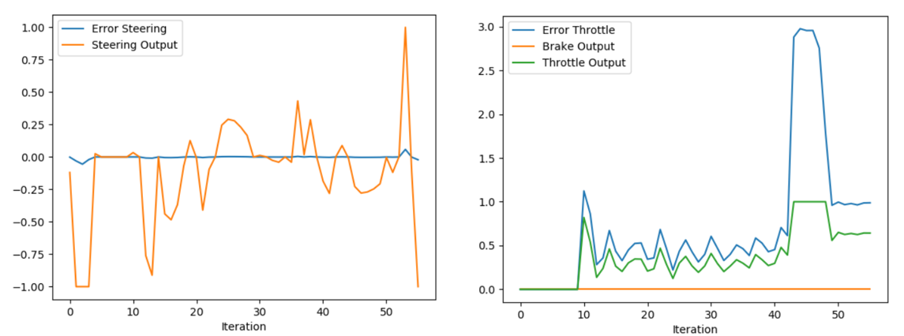
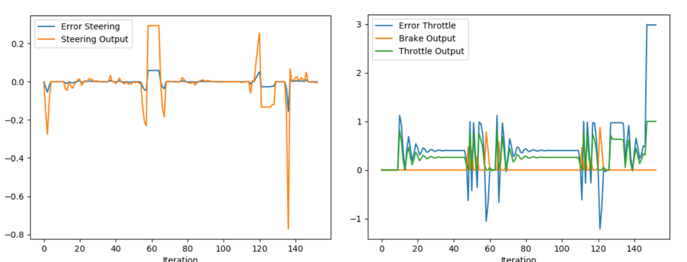
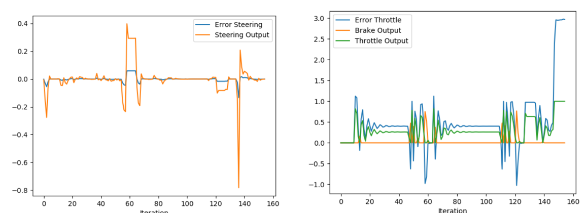
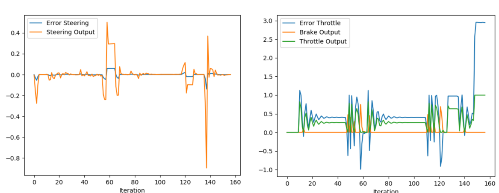

# PID Controller for Self-Driving Car

## Objective
For the Udacity Self-Driving Car Nano-degree Control project, the goal was to design a **PID (Proportional-Integral-Derivative) controller** in C++ to simultaneously control the **steering angle** and **throttle** of a vehicle. The controller interacts with the Python-based Carla simulator running on Unreal Engine 4.

The vehicle must drive smoothly around the track while staying close to the center line (minimizing Cross Track Error - CTE) without excessive oscillations or instability.

## PID Controller Implementation

The core of the project is implemented in the following files:
- `main.cpp`
- `pid_controller.cpp`
- `pid_controller.h`

### Coding Summary
A robust **PID class** was developed to handle both lateral (steering) and longitudinal (throttle) control. The controller supports:
- Independent tuning of **Kp**, **Ki**, and **Kd** gains
- Configurable output limits (saturation)
- Proper **delta_time** handling for accurate integral and derivative calculations
- **Anti-windup** mechanism to prevent integral term buildup when the actuator is saturated
- Safe initialization and first-step handling

### Important Code Snippets

**PID Initialization:**
```cpp
pid_steer.Init(Kp, Ki, Kd, max_output, min_output);
```

**Error Update (called every simulation step):**
```cpp
pid.UpdateError(cte);           // cte = cross track error
pid.UpdateDeltaTime(dt);        // dt in seconds
```

**Control Output:**
```cpp
double steering = pid_steer.TotalError();
double throttle = pid_throttle.TotalError();
```
The TotalError() method computes the classic PID formula while applying clamping and anti-windup.


# PID Controller Parameter Optimization

## Parameter Meanings and Effects

| Parameter | Meaning | Effect when Increased | Typical Range (Steering) |
| :--- | :--- | :--- | :--- |
| **Kp** | Proportional gain – reacts to current error | Stronger and faster correction (can cause oscillations) | 0.25 ~ 0.35 |
| **Kd** | Derivative gain – reacts to rate of change | Dampens oscillations, improves stability | 3.0 ~ 8.0 |
| **Ki** | Integral gain – reacts to accumulated error | Eliminates steady-state bias (can cause oscillations if too high) | 0.0005 ~ 0.005 |
Note: The integral term (Ki) must be kept very small in this project. Even modest values can quickly lead to instability due to the dynamic nature of vehicle control.

## Manual Optimization Process

Optimization was performed iteratively by testing different gain combinations and observing vehicle behavior in the simulator.

### High Kp Test (Aggressive Proportional Control)
```cpp
pid_steer.Init(100.0, 0.0, 0.0, 1.0, -1.0);   // Kp, Ki, Kd, max, min
pid_throttle.Init(0.65, 0.0, 0.08, 1.0, -1.0);
```

Result: Very aggressive steering with large fluctuations.

### Reduced Kp
```cpp
pid_steer.Init(5.0, 0.0, 0.0, 1.0, -1.0);   // Kp, Ki, Kd, max, min
pid_throttle.Init(0.65, 0.0, 0.08, 1.0, -1.0);
```

Result: Smoother behavior but still some overshoot.

### Adding Derivative (Kd)
```cpp
pid_steer.Init(5.0, 0.0, 2.0, 1.0, -1.0);   // Kp, Ki, Kd, max, min
pid_throttle.Init(0.65, 0.0, 0.08, 1.0, -1.0);
```

Result: As parameter value increases the oscillation reduced.

### Final Tuning with Integral
```cpp
pid_steer.Init(5.0, 0.01, 2.0, 1.0, -1.0);   // Kp, Ki, Kd, max, min
pid_throttle.Init(0.65, 0.0, 0.08, 1.0, -1.0);
```

Result: The vehicle follows the path smoothly with minimal oscillation and good cornering behavior.


## Answers to Project Questions

### How would you design a way to automatically tune the PID parameters?
An effective automatic tuning approach would combine simulation-based optimization with a well-defined cost function.
One strong method is Particle Swarm Optimization (PSO). In this approach, a population of "particles" (each representing a set of Kp, Ki, Kd values) explores the parameter space. Each particle evaluates the controller's performance over a fixed simulation run and updates its position based on its own best result and the swarm's global best.
The cost function could be a combination of:

- Integral of Absolute Error (IAE) or Integral of Squared Error (ISE) over the track
- Penalty for excessive control effort (steering oscillations)
- Penalty for going off-track or crashing

This method is computationally efficient compared to Genetic Algorithms and has shown excellent results in vehicle control tuning. Alternatively, the Twiddle algorithm (a simple hill-climbing method) could be implemented directly in the C++ code for online tuning during simulation.

### PID controller is a model-free controller. Could you explain the pros and cons of this type of controller?
Model-free controllers (like PID) do not require an explicit mathematical model of the vehicle dynamics.

Pros (Model-free):

- Simplicity and ease of implementation: PID requires almost no domain knowledge about the car's physics, tire models, or aerodynamics. This makes it fast to develop and deploy.
- Low computational cost: It runs efficiently even on embedded hardware with minimal processing power, which is critical for real-time control at high frequencies.

Cons (Model-free):

- Limited performance in complex scenarios: Without a model, the controller cannot anticipate future behavior or handle constraints (e.g., maximum steering rate, tire slip limits) proactively. Model-based methods like Model Predictive Control (MPC) generally achieve smoother and more optimal trajectories.
- Sensitive to tuning and environment changes: Gains that work well on one track or speed may perform poorly under different conditions (wet road, different vehicle, higher speed). Model-based controllers can adapt better using the internal model.

### (Optional) What would you do to improve the PID controller?
To further improve performance, I would consider the following enhancements:

- Gain Scheduling — Make Kp, Ki, and Kd vary dynamically based on vehicle speed or road curvature. For example, reduce Kp at high speeds for stability and increase it at low speeds for responsiveness.
- Feedforward Control — Add a feedforward term based on the upcoming path curvature (from the waypoint planner) to reduce the burden on the feedback PID.
- Cascaded or Nested PID — Use an outer PID for path tracking and inner PIDs for steering actuator and wheel speed control.
- Adaptive Tuning — Implement online adaptation (e.g., using Twiddle or a simple reinforcement learning agent) that continuously adjusts gains during driving.
- Hybrid Approach — Combine PID with a simple model-based component (e.g., Pure Pursuit for lookahead steering) or switch to MPC in critical situations.

